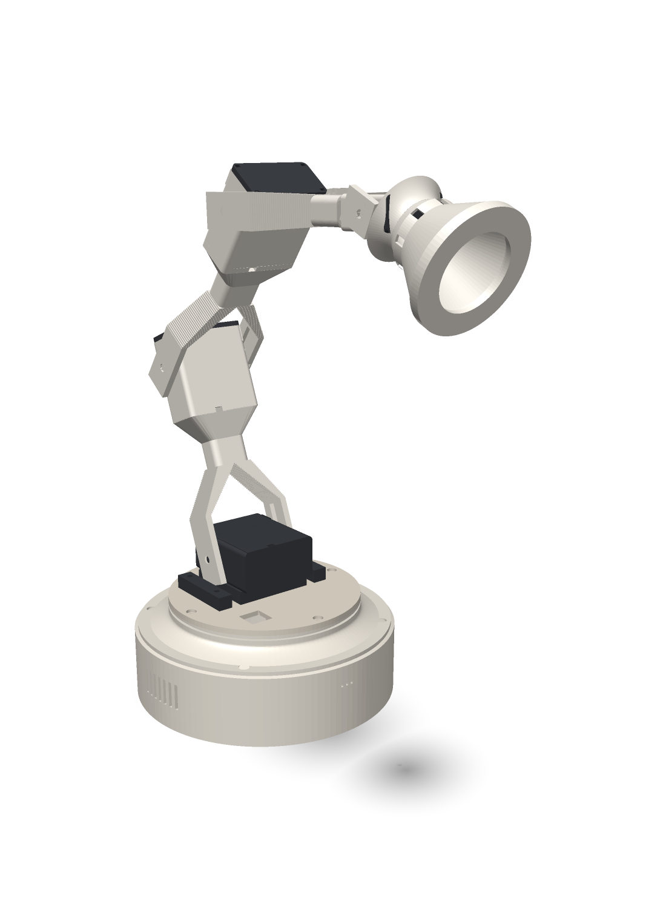

# HOTARU 2.0

An animated desk lamp that sees, hears and moves. Four MG996R joints on a
turntable base, a cone shade with a WS2812 ring for an eye, an I2S mic and
speaker, driven by an ESP32-S3.

The CAD is **pure Python** — no OpenSCAD, no CadQuery, no FreeCAD. Shapely
does 2D booleans, those profiles get extruded into watertight triangle
shells, and the shells are fused by the slicer. `cad/partlib.py` is the whole
kernel, about 600 lines.

**Every fastener is printed** except five M3 screws. No heat-set inserts, no
threaded rod, no bearings.



> The hero image above is still a **v1** render. Rebuild the v2 shots with
> `cad/render_docs.py` before trusting it as a picture of what you'll get.

---

## Print it

Four plates on a Bambu **P1S** (256 × 256 bed, ~244 usable). No supports.

| Plate | Contains |
|---|---|
| `v2-plate-1-base` | the tub (the fixed outer shell) and the head |
| `v2-plate-2-arm` | link 1 and link 2, inner and outer, plus spacers and ledges |
| `v2-plate-3-turntable` | the disc, the tower that stands on it, the two locking keys, clamps, keycap |
| `v2-plate-4-cone` | the cone shade, its cap, and the printed bolt and screw trays |

STLs and a zip of all four: [`exports/v2/`](exports/v2/)

```bash
python3 -m venv .venv && .venv/bin/pip install -r requirements.txt
.venv/bin/python cad/v2_export.py     # build every part -> exports/v2/
```

19 printed objects across those four plates. Four of them are trays — 22
bolts, 6 clamps, 2 screws, 2 disc keys print as loose multiples on one sheet,
which is deliberate and is the one case where "this part is in pieces" is
correct.

---

## Bill of materials

### Electronics

| Part | What it does | Size the CAD assumes |
|---|---|---|
| **ESP32-S3 dev board** | the brain; USB-C charging reaches the outside wall through a charge well | 64 × 30 mm board, 1.6 mm PCB, 8.5 mm pin tails |
| **MAX98357A** | I2S class-D amplifier for the speaker | 20 × 18 mm breakout, 12 mm standoff to clear the screw terminal |
| **INMP441** | I2S microphone; hears through a 2.5 mm port in the wall | 15 mm round board, **press fit** (0.10 mm) |
| **Speaker, 40 × 20 mm** | voice out, through the grille slots in the low wall | 40 × 20 × 5.5 mm incl. magnet |
| **WS2812 ring, 12 LED** | the eye, mounted on the cone cap | 45 mm outer diameter, 4 pads |
| **Cherry MX switch** | the button, on top, with a printed keycap | 15.6 mm, wired out through the inward access slot |

### Motion

| Part | Joint | Travel verified |
|---|---|---|
| **MG996R** ×1 | pan (turns the whole turntable) | 180° |
| **MG996R** ×1 | shoulder | 180° |
| **MG996R** ×1 | elbow | 180° |
| **MG996R** ×1 | head tilt | 142.5° |

Each servo uses the **stock double horn from its own bag** — the moulded one,
not a printed replacement. The pocket is a single straight slot, not a cross,
because a cross pocket would let the real horn rattle a quarter turn round
into the empty arm.

### The only things you buy that aren't printed

| Part | Count | Where |
|---|---|---|
| **M3 × 10 screw** | 4 | tower flange down into the disc |
| **M3 screw from the servo bag** | 1 | horn onto the pan servo's output shaft, counterbored below the disc face |

Everything else — bolts, clamps, keys, screws — prints. The printed threads
are a coarse **M6 major, 2 mm pitch** profile, chosen because a 0.4 mm nozzle
cannot resolve a real M6's 1 mm pitch.

---

## Does it actually work?

There is no CSG in this kernel, which means a part is a union of overlapping
watertight shells rather than one solved solid. That is fast and it prints
fine, but it means a bug can be invisible: geometry that looks right in the
viewer and comes off the plate in two pieces.

So the design is checked by a stack of audits, and **each one exists because
the layer above it passed something that was broken**:

```bash
.venv/bin/python cad/v2_onepiece.py    # is each part ONE connected solid?
.venv/bin/python cad/v2_openings.py    # does every opening reach daylight?
.venv/bin/python cad/v2_insert.py      # can each part reach its seat?
.venv/bin/python cad/v2_sweep.py       # does the turntable complete its sweep?
.venv/bin/python cad/v2_motion.py      # does every joint swing?
.venv/bin/python cad/v2_wire_check.py  # does every cable have a real route?
.venv/bin/python cad/v2_bom_check.py   # is every component in there, and does it fit?
.venv/bin/python cad/v2_margins.py     # torque, thread shear, thermal
.venv/bin/python cad/v2_audit.py       # watertight, bed fit, interference, engagement
```

The rule they are written to: **a check is not evidence until it has been
proven to fail on broken geometry.** Several of them carry their own
self-test and exit non-zero if that self-test passes, because an all-clear
from a check that cannot fail is worth nothing.

Some of what they caught, in order of embarrassment:

- A crown that printed as a **loose arc**, floating 3.2 mm off the wall.
  Every audit passed it, because checks that compare parts to *each other*
  never notice a part detached from *itself*. That's why `v2_onepiece.py`
  exists.
- Grounding that crown then **bricked up every wall opening** — speaker,
  mic, MX wires, USB — from the outside. That's why `v2_openings.py` fires
  rays to daylight instead of trusting that a hole is a hole.
- A counterbore set to a ceiling **below the boss it was supposed to clear**,
  so it did nothing at all and the gap stayed at 0.15 mm.
- The mic port reading open on one run and bricked on the next, because
  probing exactly on a hole's axis lands on the mesh's polar seam where
  parity is a coin flip. The probes are jittered now.

---

## Numbers that are assumed, not measured

Stated plainly because they are the ones most likely to be wrong on your
bench, and no audit in this repo can catch them:

- **The stock MG996R horn** (`SHORN_L 54.0`, `SHORN_W 8.0`, `SHORN_T 2.5`,
  `SHORN_HUB_D 14.0`, `SHORN_SCREW_R 12.5 / 19.5`) comes from published
  dimensions, not from calipers on the part. If yours differ, change them in
  `cad/params.py` and re-export.
- Several component dimensions in `cad/params.py` carry a literal
  `# TODO verify` — the speaker, the amp breakout, the mic board diameter.
- **Layer adhesion on your printer and filament**, which is what the printed
  thread's 25 MPa assumption really rests on.

---

## Layout

```
cad/            the kernel, the parts, and the audit stack
  partlib.py      the whole CAD kernel — 2D profiles to watertight shells
  params.py       every dimension, in one place
  v2_parts.py     the v2 geometry
  v2_*.py         the audits
exports/v2/     v2 STLs, plates, and GLBs   <- print these
exports/        v1 STLs                     <- superseded, kept for reference
web/            the project site and parts browser
firmware/       ESP32-S3 sketches (bench tests; the motion core is not written)
videos/         the HyperFrames assembly video
docs/images/    renders (currently v1)
```

**v1 is superseded.** The v1 parts (`part_arms.py`, `part_base.py`,
`plates.py`, the STLs directly in `exports/`) describe an earlier machine
built around SG90s and an A1 mini bed. It is kept because the v2 web exporter
still shares code with it, not because you should print it.

---

## Status

CAD is print-ready and every audit above passes. **Firmware is not written** —
`firmware/` holds bench tests that sweep the servos, not the motion core.

## Licence

MIT — see [LICENSE](LICENSE). The grant covers the CAD sources and the
printable geometry, not just the Python, so you can print, modify and sell
these parts.
