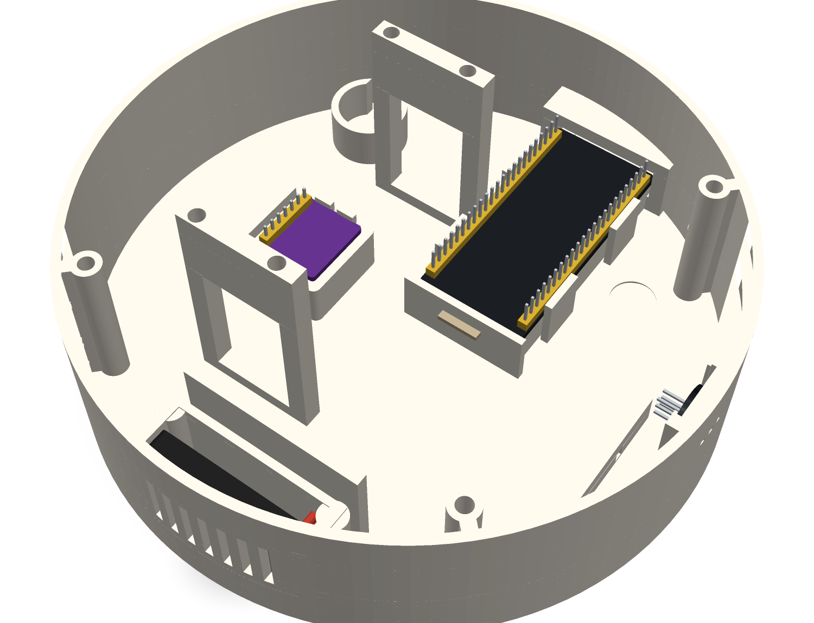
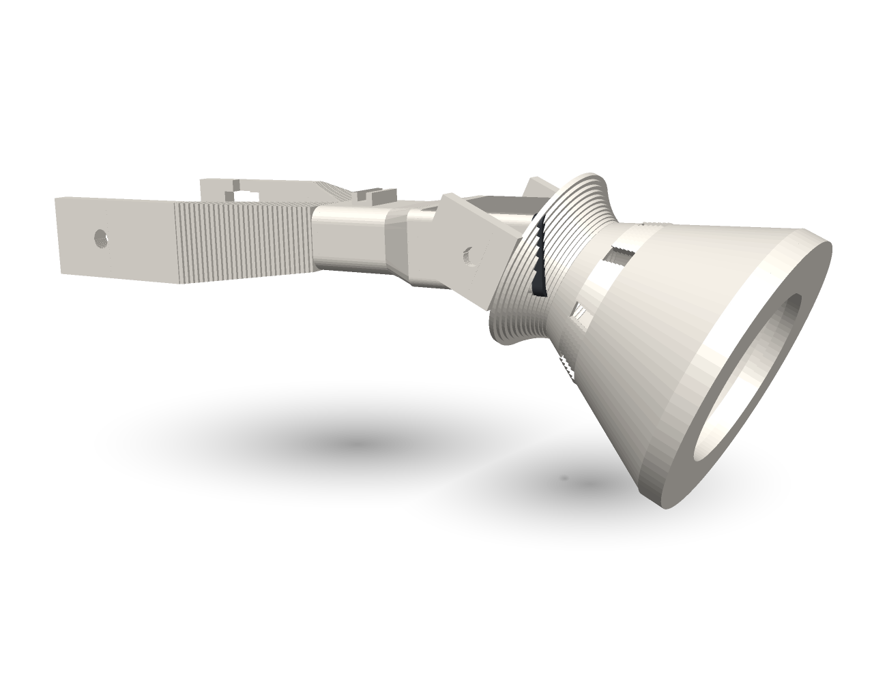
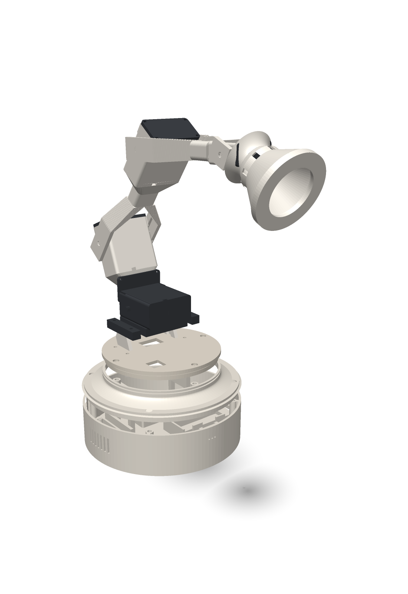
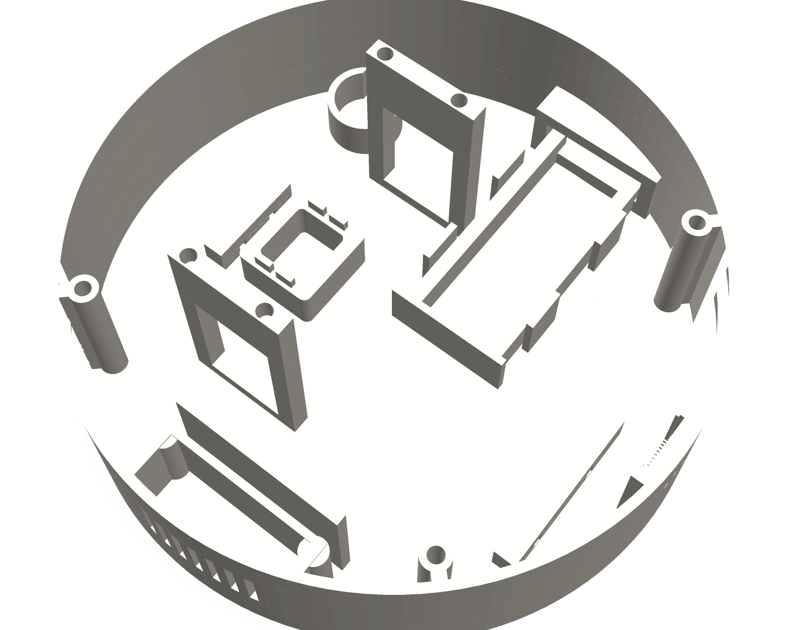

# AIBO

An animated Pixar-style desk lamp that sees, hears and moves. Round turned
base, three MG996R lift joints, SG90 head tilt, a cone shade with a WS2812
ring for an eye, I2S mic and speaker, driven by an ESP32-S3.


## Status

CAD is complete and print-ready: 17 STLs packed into 6 plates, every part
watertight, every one fits the A1 mini, **none needs supports**. Firmware is
not written yet.

```bash
python3 -m venv .venv && .venv/bin/pip install -r requirements.txt
.venv/bin/python cad/assembly.py      # build every part -> exports/
.venv/bin/python cad/plates.py        # pack into print plates -> exports/plate-*.stl
.venv/bin/python cad/audit_fit.py     # dimensional probe, non-zero on any FAIL
.venv/bin/python cad/audit_loads.py   # structural check on the load path
.venv/bin/python cad/render_docs.py   # regenerate docs/images/*.png
```

### Does it need internal bulkheads?

No — but that is a measured answer, not an opinion. `audit_loads.py` weighs
every printed part from its mesh volume, adds the servos at their joint axes,
swings the arm to its worst case and follows the load through:

| | |
|---|---|
| arm mass | 303 g (servos are 57% of it, not the plastic) |
| static moment at the base pivot | 0.48 N·m |
| design load (x3 for servo slam) | 1.44 N·m |
| base-joint bolts | 24 N — 1.6% of an M3 insert's pull-out |
| lid rib web | **38%** of design stress, 0.033 mm deflection |

The first rib web I drew ran at **114%** and the script said *put the
bulkheads back*. The fix was deeper ribs (Z0 50 → 44, t 3.2 → 4.0), not walls
through the bay. Rib depth is set by that script now, not by eye.

### Component models

[`components.py`](cad/components.py) has visual models of the real hardware —
ESP32-S3, INMP441, MAX98357A, 2040 speaker, MG996R, SG90 — placed exactly
where they sit. They are **not parts to print**; they exist so you can see
whether things seat, and so the audit can check it numerically:

```
ESP32 pin tails clear the floor      lowest pin Z7.5 vs floor 2.4
USB-C shells land in the window      Z17.4..20.9, window 14.5..24.0
mic capsule sits in the port cut     Y-75.9..-74.7
mic sits at the port height          board centre Z30.0, ports Z30.0
speaker sits in its pocket           deepest X-75.9 vs wall inner -77.6
amp pins clear the floor             Z4.4, ridges are 8.0 tall
```

`aibo-populated.glb` is the assembly with components; `aibo-assembled.glb` is
printed parts only. **Every print plate carries its own hardware too**, so
plate 2 shows the base with the ESP32, mic, amp and speaker seated, and plate
3 shows the arms with their servos — you can check fit without leaving the
plate view. The viewer splits the list into **Printed** and **Components**,
each with a show/hide-all.

Components live in the GLBs only. The STLs are byte-identical to the parts
alone (`plate-2-base.stl` == `base.stl`, 31,848 triangles), so nothing you
slice ever contains a component model.



### Viewer

Orbit the model in a browser — assembled, exploded, or any print plate:

```bash
python3 -m http.server 8765
```

then open <http://localhost:8765/viewer/>. It parses the GLBs directly in
~200 lines of WebGL; no libraries, nothing to install.



### Print order

Start with **`plate-1-test`** (spline test coupon + one horn, ~15 min). It
tells you whether the printed spline fits your servos before you commit six
hours to the rest. If it does not, print `horn-adapter` instead and screw the
stock metal horn into it — same cross, zero spline risk.

## Before you print

Numbers marked `TODO` in [`cad/params.py`](cad/params.py) came from datasheets
and product listings, **not from calipers on your actual parts**. Measure,
edit that one file, re-run `assembly.py`. Nothing downstream hardcodes a
dimension.

The two worth measuring first:

- **`SG90_FIT`** — its own parameter precisely because SG90 clones vary
  batch to batch. 0.3 tight, 0.5 loose.
- **`RING_OD` / `MIC_D` / `SPK_*`** — every enclosure cutout keys off these.
- **`SPLINE_ROOT_D` / `SCALLOP_D`** — what `spline-test` exists to settle.

`audit_fit.py` re-derives every fit from the geometry and fails loudly. Run it
after any params change. It has caught, so far: a zero-margin USB window,
cable clips floating off the end of a short tube, a 5.6 mm collision between
the arm's yoke and the lid, a lid skirt fouling the tapered bore by 2.1 mm, a
mic pocket extruded on the wrong axis (the board would have faced the
ceiling), a horn bore that gave the retaining screw nothing to clamp, and a
base-joint bolt boss missing the yoke's swing corridor by 0.05 mm.

That last batch is why it now has a **cross-part** section: every part
validating on its own says nothing about whether two of them go together.

## Design

| | |
|---|---|
| [SPEC.md](SPEC.md) | the dimensional contract |
| [cad/README.md](cad/README.md) | how the pure-python CAD kernel works |
| [exports/MANIFEST.json](exports/MANIFEST.json) | per-part stats + print notes |



Three ideas carry the whole design:

**Print orientation is the design.** Every arm segment is modelled with its
long axis along Z — yoke at the bottom, servo cup at the top — which is also
exactly how it prints. Every cross-section becomes a print layer, so there is
no bridge and no overhang past 45° anywhere in the arm.

**Torque goes through slots, not screws.** Each joint's drive plate captures
the servo horn in a cross recess. The slot walls carry the load; the screws
only stop it falling off. Clone horn screw patterns stop mattering. Likewise
the clamshells clamp the servo *body* and trap its tabs in slots, so the
mounting-hole pattern is never a load path — useful, since the brief's MG996R
hole spacing matches no drawing I can find.

**Nothing hangs off a spline.** Every joint is driven on one side and
bearing-supported by a stub axle on the other.



The base is deliberately tall — 55 mm of interior, 37 mm of it clear above the
board — because the previous build ran out of room for wiring. There are no internal
bulkheads at all — the lid is the structural member, carrying the arm's moment
through an underside rib web out to the rim, so the bay is **one open volume**
with nothing to route around. Zip-tie bars on the floor, clips down the
outside of every arm segment for the visible service loop.

A round wall curves away from a flat board end, so the USB-C window is cut
through a **tunnel boss** — a flat land filling that gap. It is the one thing
a circular base breaks that a square one does not, and without it no plug
reaches the receptacle.

**The cone** tapers 66 → 20 over 52 mm with its apex left open — no bridge to
print, and it doubles as the ring's wire exit. Its tilt pivot sits *behind*
the cone, where the taper is finally narrower than the servo housing; that is
the only place a yoke can straddle a cone without burying itself in it.

## Bill of materials

| Component | Spec | Qty |
|---|---|---|
| MCU | ESP32-S3 N16R8, dual USB-C (ROBODUINO) | 1 |
| Servo | TowerPro MG996R 180° metal gear | 3 |
| Servo | SG90 180° micro | 1 |
| Mic | INMP441 I2S MEMS (round board) | 1 |
| Amp | MAX98357A I2S 3W class-D | 1 |
| Speaker | 4Ω 2W, 2040 | 1 |
| LED | WS2812B 16-LED ring | 1 |
| Switch | Cherry MX (any) | 1 |
| Cap | 1000–2200 µF, 16 V+ | 1 |
| Screws | M3 heat-set inserts + M3 socket cap; M2 self-tappers | — |
| Horns | printed (`horn-mg996r`) or stock + `horn-adapter` | 4 |
| Power | 5 V / 3 A+ USB-C | 1 |

## Licence

MIT.
